# Enterprice Private Cloud & IaC Homelab (v3)

A fully automated private cloud environment deployed from bare metal. This project manages the lifecycle of network and server resources, from hardware preparation to multi-tenant container deployments, using Infrastructure as Code (IaC) and configuration management.

---

## 🗺️ System Architecture

### Ingress & Traffic Routing

This diagram traces how external users connect to the various VM workloads hosted on the physical hypervisor without any port-forwarding or open inbound firewall rules on the local router.

```mermaid
graph LR
    %% My Color Palette
    classDef extNode fill:#212c2a,stroke:#9580ff,color:#f8f8f2,stroke-width:2px;
    classDef tunnelNode fill:#212c2a,stroke:#ffca80,color:#ffca80,stroke-width:1px,stroke-dasharray: 5 5;
    classDef vmNode fill:#2b3b38,stroke:#70a99f,color:#f8f8f2,stroke-width:1px;
    classDef hostNode fill:#161d1c,stroke:#415854,color:#f8f8f2,stroke-width:2px;

    %% Public Clients & Cloud Services
    PublicUsers["🌐 Web Users"]:::extNode
    Gamers["🎮 Minecraft Players"]:::extNode
    GDrive["☁️ Google Drive (Cloud)"]:::extNode

    %% Inbound Tunnels
    subgraph Tunnels ["Secure Tunnels (Outbound-Only Ingress)"]
        CF["☁️ Cloudflared Tunnel"]:::tunnelNode
        PI["🔌 Playit.gg Tunnel"]:::tunnelNode
    end

    %% Physical Host & VMs
    subgraph Host ["Physical Host: hypervisor.lab.local"]
        subgraph Bridge ["Virtual Bridge Network (br0)"]
            VM2["📄 portfolio (172.30.1.93)<br>Nginx Web Server"]:::vmNode
            VM3["⚔️ minecraft (172.30.1.91)<br>Fabric Server"]:::vmNode
            VM4["🎵 navidrome (172.30.1.92)<br>Music Streamer"]:::vmNode
        end
    end

    %% Traffic Routing Paths
    PublicUsers -->|HTTPS| CF
    Gamers -->|Port 25565| PI

    CF -->|Forward Port 80| VM2
    PI -->|Forward Port 25565| VM3

    %% Storage Mounting Path
    VM4 -->|rclone FUSE Mount| GDrive

    %% Subgraph Colors
    style Host fill:#161d1c,stroke:#415854,stroke-width:2px;
    style Bridge fill:#212c2a,stroke:#70a99f,stroke-width:1px;
    style Tunnels fill:#212c2a,stroke:#ffca80,stroke-width:1px,stroke-dasharray: 5 5;
```

### System Administration & Observability

This diagram details the internal control plane, showing how client VMs authenticate via **FreeIPA** (LDAP/Kerberos/DNS) and how **Prometheus** scrapes host metrics via **Node Exporters** across all nodes.

```mermaid
graph TD
    %% My Color Palette
    classDef hostNode fill:#161d1c,stroke:#415854,color:#f8f8f2,stroke-width:2px;
    classDef ipdNode fill:#2b3b38,stroke:#ff9580,color:#ff9580,stroke-width:1.5px;
    classDef vmNode fill:#2b3b38,stroke:#70a99f,color:#f8f8f2,stroke-width:1px;
    classDef obsNode fill:#2b3b38,stroke:#8aff80,color:#8aff80,stroke-width:1.5px;

    %% Core Services
    VM1["🔑 freeipa.lab.local (172.30.1.85)<br>LDAP / Kerberos / BIND DNS"]:::ipdNode

    %% Monitored VMs (Nodes)
    subgraph Nodes ["Monitored Nodes (Port: 9100)"]
        HostOS["🖥️ Hypervisor Host (172.30.1.200)"]:::hostNode
        VM3["⚔️ minecraft VM (172.30.1.91)"]:::vmNode
        VM4["🎵 navidrome VM (172.30.1.92)"]:::vmNode
    end

    %% Monitoring Stack
    subgraph PortfolioVM ["portfolio VM (172.30.1.93)"]
        Prom["📈 Prometheus TSDB"]:::obsNode
        Grafana["📊 Grafana Dashboard"]:::obsNode
    end

    %% Telemetry Connections
    HostOS & VM1 & VM3 & VM4 & PortfolioVM -.->|Node Exporter Scrape| Prom
    Prom -->|Data Source| Grafana

    %% DNS Registry Connections
    Nodes & PortfolioVM --->|DNS Lookups| VM1

    %% Subgraph Colors
    style Nodes fill:#212c2a,stroke:#70a99f,stroke-width:1px;
    style PortfolioVM fill:#161d1c,stroke:#415854,stroke-width:2px;
```

