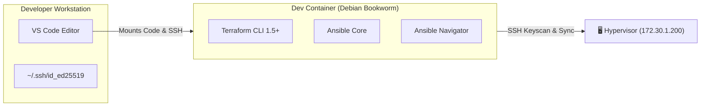

# 🛠️ Local Development Environment Setup

This document describes how the development workspace is containerized to guarantee identical Ansible and Terraform runtime environments for all operators, regardless of their host OS (Linux, macOS, or Windows).

---

## 🏗️ Dev Container Architecture

The workspace utilizes **VS Code Dev Containers** backed by a custom `Dockerfile` to compile and cache all required configuration and deployment tools.



---

## 📄 Dockerfile Configuration (`.devcontainer/Dockerfile`)

The container is built from `mcr.microsoft.com/devcontainers/python:1-3.12-bookwork` and executes the following layers:

1.  **System Package Layer**: Updates `apt` caches and installs `curl`, `gnupg`, `git`, `openssh-client`, and `genisoimage`. (Note: `genisoimage` is critical as Terraform uses it to generate custom ISO disks for cloud-init injection).
2.  **Terraform CLI Layer**: Imports the official Hashicorp GPG key, adds the HashiCorp Debian repository, and installs `terraform` directly.
3.  **Python / Ansible Layer**: Upgrades `pip` and installs the Python infrastructure tools:
    *   `ansible`: The automation engine
    *   `ansible-navigator`: A terminal user interface (TUI) for running and inspecting playbooks.
    *   `ansible-lint`: A linter to enforce playbook best practices.

---

## ⚙️ Dev Container Settings (`.devcontainer/devcontainer.json`)

*   **Extenstions**: `ms-python.python`, `redhat.ansible`, `hashicorp.terraform`, and `eamodio.gitlens` inside the container.
*   **SSH Socket Mounting**: Binds the host user's SSH folder:

```json
"mounts": [
    "source=${localEnv:HOME}/.ssh,target=/home/vscode/.ssh,type=bind,consistency=cached"
]
```

*   **Post-Create Script**: Runs `ssh-keyscan` on the target hypervisor host (`172.30.1.200`) on first load to prevent interactive "unknown host key" prompts during Terraform runs.

---

## 🚀 How to Run the Environment

1.  Open the project root directory in VS Code.
2.  Open the Command Palette (`Ctrl+Shift+P`) on Linux/Windows, `Cmd+Shift+P` on macOS).
3.  Type and select: `Dev Containers: Reopen in Container`.
4.  Once built, verify the toolchains are ready:

```bash
terraform --version
ansible --version
ansible-navigator --version
```
