# 🖥️ Bare-Metal HYpervisor Preparation

This document outlines the system configuration, storage layout, and virtualization software stack initialized on the physical server host (`hypervisor.lab.local` - `172.30.1.200`).

---

## 🏗️ Hypervisor Virtualization Stack

The hypervisor runs bare-metal **AlmaLinux 10** with hardware-assisted virtualization enabled. The software architecture is structured as follows:

```mermaid
graph TD
    %% My Color Palette
    classDef uiNode fill:#212c2a,stroke:#9580ff,color:#f8f8f2,stroke-width:2px;
    classDef libNode fill:#2b3b38,stroke:#70a99f,color:#f8f8f2,stroke-width:1.5px;
    classDef hwNode fill:#151d1c,stroke:#415854,color:#f8f8f2,stroke-width:2px;

    subgraph Admin ["Management Interfaces"]
        Cockpit["🌐 Cockpit Web UI (Port 9090)"]:::uiNode
        Virsh["💻 virsh CLI / SSH"]:::uiNode
    end

    subgraph LibvirtStack ["Virtualization Plane"]
        Libvirtd["⚙️ libvirtd Daemon"]:::libNode
        QemuKVM["🛡️ QEMU / KVM Kernel Modules"]:::libNode
    end

    subgraph Hardware ["Physical Host Resources"]
        CPU["🖥️ AMD Ryzen 7 6800H (8C/16T)"]:::hwNode
        RAM["💾 32GB DDR5 RAM"]:::hwNode
        Storage["💿 1TB NVMe (Thin-provisioned LVM)"]:::hwNode
    end

    Cockpit & Virsh ===>|Controls API| Libvirtd
    Libvirtd ===>|Manages VM CPU/RAM schedulers| QemuKVM
    QemuKVM ===>|Exposes hardware execution| CPU & RAM & Storage

    %% Subgraph Colors
    style Admin fill:#161d1c,stroke:#9580ff,stroke-width:1px;
    style LibvirtStack fill:#161d1c,stroke:#70a99f,stroke-width:1px;
    style Hardware fill:#161d1c,stroke:#415854,stroke-width:1px;
```



---

## 📦 Software Stack Specifications

The automation is defined in `ansible/playbooks/02_kvm_setup.yml` and installs:

*   `qemu-kvm`: The backend machine emulator that provides hardware-assisted virtualization.
*   `libvirt`: The daemon library that provides a stable virtualization management API.
*   `virt-install`: A command-line utility used to instantiate new virtual guests.
*   `cockpit` & `cockpit-machine`: A lightweight web interface (listening on port `9090`) to monitor host CPU, RAM, and manage virtual machines.

---

## 🛠️ Execution & Initialization Tasks

The Ansible playbook executes threee key system preparation tasks:

### 1.  Repository Setup & Utilities (`01_host_prep.yml`)

*   Enables the **EPEL(Extra Packages for Enterprise Linux)** repository.
*   Installs utility tools: `htop`, `tmux`, `git`, and `curl`.
*   Configures the system timezone to `Asia/Seoul`.

### 2.  User Permission Configuration

*   Adds the administrative user `sho` to the `libvirt` group:

```yaml
ansible.builtin.user:
    name: ""{{ admin_user }}
    groups: libvirt
    append: true
```

*This allows running KVM administrative commands (`virsh`) without executing `sudo`.

### 3.  Systemd Services Integration

*   Starts and enables:
    *   `libvirtd`: The virtualization controller.
    *   `cockpit.socket`: The web administration server socket.

---

## 🌐 Network Bridge Configuration

For the virtual machines to be fully visible on the local subnet(`172.30.1.0/24`), a network bridge named `br0` must be configured on the host network adapter.

Verify the status of the network bridge on the hypervisor using `nmcli`:

```bash
# View active bridge and interface mappings
nmcli device status
```

*Ensure `br0` is active and binding the physical Ethernet adapter.*
