# 📐 Infrastructure Provisioning with Terraform

This document covers the Infrastructure as Code (IaC) configuration and execution steps used to provision the homelab virtual machine guests on the KVM hypervisor.

---

## 🛠️ Automated Provisioning Pipeline

The lifecycle of the virtual machines---from storage volume creation to system configuration injection---is managed declaratively.

```mermaid
graph TD
    %% My Color Palette
    classDef inputNode fill:#212c21,stroke:#9580ff,color:#f8f8f2,stroke-width:1.5px;
    classDef tfNode fill:#2b3b38,stroke:#70a99f,color:#f8f8f2,stroke-width:2px;
    classDef hostNode fill:#161dc,stroke:#415854,color:#f8f8f2,stroke-width:2px;
    classDef guestNode fill:#2b3b38,stroke:#8aff80,color:#f8f8f2,stroke-width:1.5px;

    subgraph Configs ["Declarative Configuration Files"]
        MainTF["📄 main.tf<br>(Resource Specifications)"]:::inputNode
        CloutInit["📄 cloud_init.cfg<br>(User Provisioning Template)"]:::inputNode
        NetConfig["📄 network_config.cfg.tpl<br>(Static IP Mappings)"]
    end

    Terraform["🚀 Terraform Provider<br>(dmacvicar/libvirt)"]:::tfNode

    subgraph Host ["hypervisor.lab.local (172.30.1.200)"]
        BaseImage["💿 Cloud base OS templates<br>(Alma10 & Deb12)"]:::hostNode
        StoragePool["🗂️ VM Storage Pool<br>(/var/lib/libvirt/images/vm_pool)"]:::hostNode
    end

    subgraph Guests ["Provisional Virtual Machines"]
        freeipa["🔑 freeipa VM"]:::guestNode
        portfolio["📄 portfolio VM"]:::guestNode
        minecraft["⚔️ minecraft VM"]:::guestNode
        navidrome["🎵 navidrome VM"]:::guestNode
    end

    MainTF & CloudInit & NetConfig ===>|Parsed on Apply| Terraform
    Terraform ===>|Executes Provisioning via SSH| Host
    StoragePool -.->|Clones thin OS volumes from| BaseImages
    Host ===>|Boots with CLoud-Init ISOs| Guests

    %% Subgraph Colors
    style Configs fill:#161d1c,stroke:#9580ff,stroke-width:1px;
    style Host fill:#161d1c,stroke:#415854,stroke-width:1px;
    style Guests fill:#161d1c,stroke:#8aff80,stroke-width:1px;
```



---

## 🔌 Libvirt Provider

Terraform targets the KVM hypervisor remotely using the community-supported `dmacvicar/libvirt` provider. The connection is established over SSH:

```hcl
provider "libvirt" {
    uri = "qemu+ssh://sho@172.30.1.200/system"
}
```

*This utilizes SSH Agent Forwarding inside the Dev Container to authenticate to the hypervisor without copying private SSH keys into the workspace.*

---

## 💾 Storage Pool & Image Management

Virtual machines are provisioned with storage volumes allocated from a single directory-backed storage pool:

*   **Storage Path**: `/var/lib/libvirt/images/vm_pool`
*   **Base Volumes**: Cloud images are downloaded directly from upstream repositories and set as read-only base templates:
    *   `almalinux10-base.qcow2` (AlmaLinux Generic Cloud Image)
    *   `debian12-base.qcow2` (Debian Bookworm Generic Cloud Image)
*   **Instance Volumes**: The storage volumes for individual VMs are created as clones pointing to these base templates, enabling thin-provisioning and near-instant VM creation.

---

## ⚙️ Bootstrapping with Cloud-Init

VM custom attributes(like networks, users, and packages) are configured on first boot via Cloud-Init.

### 1.  User Configuration (`terraform/templates/cloud_init.cfg`)

Sets up the admin user and secures the host:

*   Injects the administrator user `sho`.
*   Adds the user to the `wheel`(sudoers) group with passwordless privileges(`NOPASSWD:ALL`).
*   Injects the public SSH key.
*   **Hardening**: Disables password authentication in `/etc/ssh/sshd_config` and restarts the SSH daemon.

### 2. Network Configuration (`terraform/templates/network_config.cfg.tpl`)

Applies static networking configuration:

```yaml
version: 2
ethernets:
    ${interface_name}:
        dhcp4: no
        addresses:
            - ${ip_address}/24
        routes:
            - to: default
              via: ${gateway_ip}
        nameservers:
            addresses:
                - ${dns_ip}
                - 1.1.1.1
```

*Note: The primary nameserver points to `172.30.1.85`(the FreeIPA DNS server), with a fallback to `1.1.1.1`.

---

## 🖥️ VM Guest Resources

Virtual machines are declared with `host-passthrough` CPU modes to expose modern instruction sets(critical for AlmaLinux 10's `x86-64-v3` architecture requirement):

*   **freeipa**: 3072 MB RAM, 2 vCPUs, 40 GB Storage
*   **portfolio**: 1024 MB RAM, 1 vCPU, 10 GB Storage
*   **minecraft**: 6144 MB RAM, 2 vCPU, 20 GB Storage
*   **navidrome**: 1024 MB RAM, 1 vCPU, 15 GB Storage

---

## 🚀 Execution Command Sequence

Run the following commands inside the `terraform/` directory:

```bash
# Initialize provider plugins
terraform init

# Validate configuration syntaxes
terraform validate

# Review proposed changes
terraform plan

# Apply deployment changes
terraform apply
```
