# 🔑 Centralized Identity & DNS Management (FreeIPA)

This document details the configuration, deployment, and operation of the centralized identity domain and directory services managed by **FreeIPA** running on `freeipa.lab.local` (`172.30.1.85`).

---

## 🏛️ Directory & DNS Resolution Architecture

The FreeIPA virtual machine functions as the central authority for authentication, authorization, domain-name resolution, and internal certificates:

```mermaid
graph LR
    %% My Color Palette
    classDef clientNode fill:#212c2a,stroke:#70a99f,color:#f8f8f2,stroke-width:1.5px;
    classDef ipaNode fill:#2b3b38,stroke:#ff9580,color:#ff9580,stroke-width:1.5px;
    classDef extNode fill:#212c2a,stroke:#9580ff,color:#f8f8f2,stroke-width:2px;

    subgraph Clients ["Homelab Clients (*.lab.local)"]
        VMs["🖥️ Guest VMs<br>(portfolio, minecraft, etc.)"]:::clientNode
    end

    subgraph FreeIPA ["FreeIPA Server (freeipa.lab.local)"]
        DNS["🌐 BIND DNS Server<br>(Port 53)"]:::ipaNode
        KDC["🎟️ Kerberos KDC<br>(Ports 88/464)"]:::ipaNode
        LDAP["🗄️ 389 Directory Server<br>(Ports 389/636)"]:::ipaNode
        CA["🛡️ Dogtag PKI CA<br>(Certificate Authority)"]:::ipaNode
    end

    Upstream["🌐 Cloudflare DNS<br>(1.1.1.1)"]:::extNode

    VMs -->|1. Resolves local queries| DNS
    DNS -->|2. Forwards external queries| Upstream
    VMs -->|3. Requests Kerberos ticket| KDC
    VMs -->|4. Authenticates user query| LDAP
    VMs -->|5. Trusts issued SSL certs| CA

    %% Subgraph Colors
    style Clients fill:#161d1c,stroke:#70a99f,stroke-width:1px;
    style FreeIPA fill:#161d1c,stroke:#ff9580,stroke-width:2px;
```



---

## 📄 Ansible Configuration (`ansible/playbooks/03_freeipa_install.yml`)

The deployment of FreeIPA is automated using Ansible:

### 1.  FQDN and Hostname Setup

Updates the virtual machine kernel hostname to `freeipa.lab.local` to satisfy FreeIPA's strict fully-qualified domain name (FQDN) verification requirements.

### 2.  Package Management

Installs the following packages:

*   `freeipa-server` & `freeipa-server-dns`: The directory server components.
*   `bind` & `bind-utils`: DNS server utilities.
*   `firewalld` & `python3-firewall`: Local system firewall management tools.

### 3.  Unattended Server Installation

The playbook runs the installer in non-interactive mode using variables declared in the inventory group variables:

```bash
ipa-server-install \
    --unattended \
    --realm=LAB.LOCAL \
    --domain=lab.local \
    --ds-password=xxxxx \
    --admin-password=xxxxx \
    --setup-dns \
    --forwarder=1.1.1.1 \
    --no-host-dns
```

*   **Integrated DNS**: DNS is configured to resolve local hosts(`*.lab.local`) and forward unresolved queries to the upstream server (`1.1.1.1`).
*   **Timeout Handling**: Due to the time-intensive generation of cryptographic PKI keys during installation, the Ansible command timeout is increased to 1200 seconds.

### 4.  Port Protection & Firewall Rules

Ensures the local system firewall allows traffic across the directory network services:

*   `freeipa-ldaps`(Port 636) and `freeipa-ldap`(Port 389)
*   `dns`(Port 53 TCP/UDP)
*   `kerberos`(Ports 88/464 TCP/UDP)

---

## 🚀 Execution & Verification

Run the playbook using the following command:

```bash
ansible-playbook site.yml --tags "freeipa" --ask-vault-pass
```

### Verification Checks

1.  **Access the GUI Console**: Open a web browser on a workstation connected to the bridge network and navigate to `https://freeipa.lab.local`. Log in using the `admin` username.
2.  **Kerberos Authentication Check**: SSH into the FreeIPA VM and verify ticket validation:

```bash
# Request a Kerberos ticket
kinit admin

# View active ticket credentials
klist
```

3.  **DNS Verification**: Query the DNS server directly to verify lookups:

```bash
dig @172.30.1.85 freeipa.lab.local +short
# 172.30.1.85
```

---

## 🔑 Client Enrollment

To enroll a client virtual machine(such as `portfolio` or `minecraft`) into the `LAB.LOCAL` identity realm, execute the client installer on the target node:

```bash
sudo ipa-client-install \
    --mkhomedir \
    --no-ntp \
    --unattended
```

*   `--mkhomedir`: Configures PAM(`pam_oddjob_mkhomedir` or `pam_mkhomedir`) to automatically create a local `/home/` directory upon a user's first login via SSH.
