# 📦 Application Container Deployments

This document details the containerized application architecture, storage mounts, and Systemd service mappings deployed across the virtual machine nodes using rootless **Podman**.

---

## 🏗️ Application & Systemd Service Architecture

Every application workload runs inside an isolated rootless container. The host's local **Systemd** daemon manages the startup dependencies and lifecycle of the containers:

### 1. Portfolio Web Server (`portfolio.lab.local`)
Exposes the portfolio static webpage assets using an Nginx Alpine container containerized by a simple Systemd unit wrapper.

```mermaid
graph TD
    %% My Color Palette
    classDef vmNode fill:#161d1c,stroke:#70a99f,color:#f8f8f2,stroke-width:1.5px;
    classDef svcNode fill:#212c2a,stroke:#9580ff,color:#f8f8f2,stroke-width:1px;
    classDef appNode fill:#2b3b38,stroke:#8aff80,color:#8aff80,stroke-width:1.5px;

    subgraph VM_Portfolio ["portfolio.lab.local VM"]
        Svc_Portal["⚙️ portal.service<br>(Systemd)"]:::svcNode
        App_Nginx["🌐 Nginx Web Server<br>(Port 80)"]:::appNode
        SiteFiles["📁 /home/sho/containers/portal<br>(Static HTML/CSS/JS)"]:::vmNode
    end

    Svc_Portal ===>|Launches & restarts| App_Nginx
    App_Nginx -->|Mounts assets read-only| SiteFiles

    %% Subgraph Colors
    style VM_Portfolio fill:#111615,stroke:#70a99f,stroke-width:1px;
```



---

### 2. Fabric Minecraft Server (`minecraft.lab.local`)
Runs a Java-based Minecraft game server node with Fabric mod loaders and maps a persistent directory for user/world preservation.

```mermaid
graph TD
    %% My Color Palette
    classDef vmNode fill:#161d1c,stroke:#70a99f,color:#f8f8f2,stroke-width:1.5px;
    classDef svcNode fill:#212c2a,stroke:#9580ff,color:#f8f8f2,stroke-width:1px;
    classDef appNode fill:#2b3b38,stroke:#8aff80,color:#8aff80,stroke-width:1.5px;

    subgraph VM_Minecraft ["minecraft.lab.local VM"]
        Svc_Minecraft["⚙️ minecraft.service<br>(Systemd)"]:::svcNode
        App_MC["⚔️ Fabric Server<br>(Port 25565)"]:::appNode
        MCDatabase["📁 /home/sho/containers/minecraft<br>(Persistent /data)"]:::vmNode
    end

    Svc_Minecraft ===>|Launches & restarts| App_MC
    App_MC -->|Mounts database read-write| MCDatabase

    %% Subgraph Colors
    style VM_Minecraft fill:#111615,stroke:#70a99f,stroke-width:1px;
```



---

### 3. Navidrome Music Server (`navidrome.lab.local`)
Traces the startup dependencies where Google Drive is FUSE-mounted via `rclone` before the Navidrome audio engine mounts and indexes the path.

```mermaid
graph TD
    %% My Color Palette
    classDef vmNode fill:#161d1c,stroke:#70a99f,color:#f8f8f2,stroke-width:1.5px;
    classDef svcNode fill:#212c2a,stroke:#9580ff,color:#f8f8f2,stroke-width:1px;
    classDef appNode fill:#2b3b38,stroke:#8aff80,color:#8aff80,stroke-width:1.5px;
    classDef mountNode fill:#212c2a,stroke:#ffca80,color:#ffca80,stroke-width:1px;

    subgraph VM_Navidrome ["navidrome.lab.local VM"]
        Svc_Rclone["⚙️ rclone-mount.service<br>(Systemd)"]:::svcNode
        Svc_Navidrome["⚙️ navidrome.service<br>(Systemd)"]:::svcNode
        App_ND["🎵 Navidrome Streamer<br>(Port 4533)"]:::appNode
        GDrive["☁️ Google Drive<br>(FUSE Mount: /mnt/gdrive)"]:::mountNode
    end

    Svc_Rclone ===>|Mounts remote GDrive via| GDrive
    Svc_Navidrome ===>|Launches streamer| App_ND
    Svc_Navidrome -.->|Requires active mount| Svc_Rclone
    App_ND -->|Scrapes MP3 audio files from| GDrive

    %% Subgraph Colors
    style VM_Navidrome fill:#111615,stroke:#70a99f,stroke-width:1px;
```



---

## 📄 Application Specifications

The container lifecycle is automated via `ansible/playbooks/04_services_deploy.yml`:

### 1.  Portfolio Hub (`portfolio.lab.local`)

*   **Engine**: Launches `docker.io/library/nginx:alpine` using rootless Podman.
*   **Statis Assets**: Clones and mounts the HTML/CSS website files into `/usr/share/nginx/html` in read-only(`ro`) mode.
*   **Port Mapping**: Maps container port to 80 to target port 80 of the virtual machine.

### 2.  Fabric Minecraft Server (`minecraft.lab.local`)

*   **Engine**: Launches `docker.io/itzg/minecraft-server:java17`(java-based wrapper).
*   **Configurations**:
    *   `EULA=TRUE`: Accepts user agreements.
    *   `TYPE=FABRIC`: Deploys Fabric mod loader.
    *   `VERSION=1.20.1`: Deploys game runtime version.
    *   `MEMORY=4G`: Allocates memory bounds(configured dynamically via variables).
    *   `MODRINTH_PROJECTS`: Deploys specific mod files(Fabric API, Architectury API, Geckolib, Kotlin runtime, hamster pets, etc.).
*   **Persistent Storage**: Mounts `/home/sho/containers/minecraft` to `/data` in read-write mode to preserve world data, player profiles, and server properties.

### 3.  Music Streaming Node (`navidrome.lab.local`)

*   **rclone Google Drive FUSE Mount**:
    *   Installed packages `fuse3` and `rclone`.
    *   Modifies `/etc/fuse.conf` to enable `user_allow_other`(allowing rootless containers to read paths mounted by host users).
    *   Configures `rclone` with Google Drive credentials and spawns a background mount service daemon(`rclone-mount.service`) directing drive data to `/mnt/gdrive` using cache mode `full`(cached locally for 24h).
*   **Navidrome Engine**:
    *   Launches `docker.io/deluan/navidrome:latest`.
    *   Mounts the FUSE path `/mnt/gdrive` into `/music:ro`.
    *   Systemd configurations map a `Requires=rclone-mount.service` dependency, preventing the Navidrome container from running if the Google Drive FUSE mount fails.

---

## 🚀 Execution & Management

Deploy the application containers using the Ansible tags target:

```bash
ansible-playbook site.yml --tags "services" --ask-vault-pass
```

### Container Status Verification

Log in to any service virtual machine and query Podman:

```bash
# View running container status
podman ps

# Inspect container startup logs
podman logs navidrome
```
