# 🌩️ Ingress & Secure Tunnels

This document outlines the zero-trust remote access architecture of the homelab. By utilizing outbound-only secure tunnels (**Cloudflared** and **Playit.gg**), external services are exposed without configuring port forwarding or opening inbound router ports.

---

## 🏗️ Tunnel Ingress Architectures

Traffic ingress is divided into two separate pathways: HTTP web traffic via Cloudflare, and TCP/UDP game server traffic via Playit.gg.

### 1.  Cloudflare HTTPS Ingress (Web Portals)

Handles secure HTTPS traffic routing for the Nginx portfolio website and the Grafana analytics dashboard.

```mermaid
graph LR
    %% My Color Palette
    classDef extNode fill:#212c2a,stroke:#9580ff,color:#f8f8f2,stroke-width:1.5px;
    classDef agentNode fill:#212c2a,stroke:#ffca80,color:#ffca80,stroke-width:1px,stroke-dasharray: 5 5;
    classDef appNode fill:#2b3b38,stroke:#8aff80,color:#8aff80,stroke-width:1.5px;

    subgraph WAN ["Public WAN"]
        User["🌐 Web Browser"]:::extNode
        CFEdge["☁️ Cloudflare Edge Network"]:::extNode
    end

    subgraph VM_Portfolio ["portfolio.lab.local VM"]
        Agent_CF["🐳 cloudflared container<br>(--net=host)"]:::agentNode
        App_Nginx["🌐 Nginx Port 80"]:::appNode
        App_Grafana["📊 Grafana Port 3000"]:::appNode
    end

    User -->|HTTPS Query| CFEdge
    CFEdge ===>|Encrypted Tunnel Stream| Agent_CF
    Agent_CF -->|Proxies HTTP traffic| App_Nginx
    Agent_CF -->|Proxies HTTP traffic| App_Grafana

    %% Subgraph Colors
    style VM_Portfolio fill:#111615,stroke:#70a99f,stroke-width:1px;
    style WAN fill:#161d1c,stroke:#9580ff,stroke-width:1px;
```



### 2. Playit.gg Game Ingress (Minecraft Server)

Routes game packets for external players into the local Fabric server instance using a secure UDP/TCP agent connection.

```mermaid
graph LR
    %% My Color Palette
    classDef extNode fill:#212c2a,stroke:#9580ff,color:#f8f8f2,stroke-width:1.5px;
    classDef agentNode fill:#212c2a,stroke:#ffca80,color:#ffca80,stroke-width:1px,stroke-dasharray: 5 5;
    classDef appNode fill:#2b3b38,stroke:#8aff80,color:#8aff80,stroke-width:1.5px;

    subgraph WAN_Game ["Public WAN"]
        Player["🎮 Game Client"]:::extNode
        PlayitWAN["🔌 Playit.gg Global Proxy"]:::extNode
    end

    subgraph VM_Minecraft ["minecraft.lab.local VM"]
        Agent_Playit["🐳 playit-agent container<br>(--net=host)"]:::agentNode
        App_MC["⚔️ Fabric Server Port 25565"]:::appNode
    end

    Player -->|TCP/UDP Game Packets| PlayitWAN
    PlayitWAN ===>|Encrypted Tunnel Stream| Agent_Playit
    Agent_Playit -->|Proxies raw TCP/UDP| App_MC

    %% Subgraph Colors
    style VM_Minecraft fill:#111615,stroke:#70a99f,stroke-width:1px;
    style WAN_Game fill:#161d1c,stroke:#9580ff,stroke-width:1px;
```



---

## 📄 Service Configurations

The outbound tunnel agents are launched as rootless container daemons:

### 1.  Cloudflare Tunnel Agent (`06_cloudflared_setup.yml`)

*   **Engine**: Spawns `docker.io/cloudflare/cloudflared:latest` using `--net=host`.
*   **Credentials**: Authenticates with Cloudflare using a secure credential token(`cloudflare_token`) managed inside the encrypted Ansible Vault file(`vms/vault.yml`).
*   **Systemd Integration(`cloudflared.service`)**: Configures startup sequencing to ensure the local web application services(`portal.service`) are active before starting the tunnel agent:

```ini
[Unit]
After=network-online.target portal.service
Wants=network-online.target portal.service
```

### 2.  Playit.gg Tunnel Agent (`05_playit_setup.yml`)

*   **Engine**: Spawns `ghcr.io/playit-cloud/playit-agent:1.0` using `--net=host` to bridge internal traffic.
*   **Credentials**: Authenticates using a cryptographically generated static secret key(`playit_secret_key`) mapped to the agent container's environment variables(`SECRET_KEY`).
*   **Systemd Integration(`playit.service`)**: Chains the agent startup process to load immediately after Minecraft service completes:

```ini
[Unit]
After=network-online.target minecraft.service
Wants=network-online.target minecraft.service
```

---

## 🚀 Execution & Administration

To deploy or refresh the ingress tunnels, run the following playbooks:

```bash
ansible-playbook site.yml --tags "playit,cloudflared" --ask-vault-pass
```

### Checking Tunnel Status

Inspect active connections on the respective VMs by viewing Systemd status outputs:

```bash
# Verify connection logs and exit statuses
systemctl status cloudflared.service
systemctl status playit.service
```
