# 📊 Observability & Telemetry

This document details the configuation and design of the cluster-wide telemetry scraping infrastructure utilizing **Prometheus**, **Grafana**, and native **Node Exporter**.

---

## 📈 Observability Architecture

Prometheus scrapes node metrics periodically via Node Exporter agents listening on port `9100` across the bridge network:

```mermaid
graph TD
    %% My Color Palette
    classDef hostNode fill:#161d1c,stroke:#415854,color:#f8f8f2,stroke-width:2px;
    classDef ipdNode fill:#2b3b38,stroke:#ff9580,color:#ff9580,stroke-width:1.5px;
    classDef vmNode fill:#2b3b38,stroke:#70a99f,color:#f8f8f2,stroke-width:1.5px;
    classDef obsNode fill:#2b3b38,stroke:#8aff80,color:#8aff80,stroke-width:1.5px;

    VM1["🔑 freeipa.lab.local (172.30.1.85)<br>LDAP / Kerberos / BIND DNS"]:::ipdNode

    subgraph Nodes ["Monitored Nodes (Port: 9100)"]
        HostOS["🖥️ Hypervisor Host (172.30.1.200)"]:::hostNode
        VM2["📄 portfolio VM (172.30.1.93)"]:::vmNode
        VM3["⚔️ minecraft VM (172.30.1.91)"]:::vmNode
        VM4["🎵 navidrome VM (172.30.1.92)"]:::vmNode
    end

    subgraph PortfolioServices ["portfolio VM Services"]
        Prom["📈 Prometheus TSDB"]:::obsNode
        Grafana["📊 Grafana Dashboard"]:::obsNode
    end

    HostOS & VM1 & VM2 & VM3 & VM4 -.->|Node Exporter Scrape| Prom
    Prom -->|Data Source Query| Grafana

    Nodes --->|DNS Lookups| VM1

    %% Subgraph Colors
    style Nodes fill:#212c2a,stroke:#70a99f,stroke-width:1px;
    style PortfolioServices fill:#161d1c,stroke:#415854,stroke-width:2px;
```



---

## 📄 Service Configurations

Telemetry collectors are automated via `ansible/playbooks/07_observability.yml`:

### 1.  Prometheus Node Exporter (Daemon Node)

*   **Engine**: Downloads the native `node_exporter-1.8.2.linux-amd64` release binary and places it under `/usr/local/bin/node_exporter`.
*   **Systemd Integration (`node_exporter.service`)**: Deploys a background daemon unit configured to run the exporter immediately after network interfaces load.
*   **SELinux Contexts (AlmaLinux)**: Automatically runs `restorecon` to preserve SELinux contexts for the binary and service files.
*   **Security**: Opens port `9100/tcp` on firewalld on RedHat-family systems to allow scrapers to read metric inputs.

### 2. Prometheus Engine (`prometheus.yml.j2`)

*   **Engine**: Containerized using `docker.io/prom/prometheus:latest` running with `--net=host` on the `portfolio` VM.
*   **Storage Mounts**: Maps the host folder `/home/sho/containers/prometheus/data` to `/prometheus` with tag properties `:z,U`(ensuring rootless Podman SELinux permissions map correctly to local storage directories).
*   **Scrape Loop Specifications**: Sets a scrape and evaluation interval of 15 seconds:

```yaml
global:
    scrape_interval: 15s
    evaluation_interval: 15s

scrape_configs:
    - job_name: 'homelab-nodes'
      static_configs:
        - targets:
            - '172.30.1.200:9100' # Host
            - '172.30.1.85:9100' # freeipa
            - '172.30.1.93:9100' # portfolio
            - '172.30.1.91:9100' # minecraft
            - '172.30.1.92:9100' # navidrome
```

### 3.  Grafana Dashboard

*   **Engine**: Runs `docker.io/grafana/grafana-oss:latest` in a container mapping port `3000:3000`.
*   **Data Persistence**: Mounts `/home/sho/containers/grafana/data` to preserve custom dashboards, datasources, and user configurations between restarts.

---

## 🚀 Execution & Monitoring

To deploy the observability stack across the cluster nodes, run the following:

```bash
ansible-playbook site.yml --tags "observability" --ask-vault-pass
```

### Checking Scraping Sinks

1.  **Prometheus Targets Console**: Access the Prometheus TUI interface by opening `http://172.30.1.93:9000/targets` and verify that all 5 target hosts report `UP`.
2   **Grafana Portal**: Navigate to `http://172.30.1.93:3000` to create custom query dashboards. *(Default port is mapped externally via Cloudflared Tunnel).*
